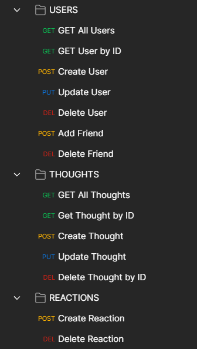

# Social Networking API 💬


## *Description*
___
NoSQL RESTful API for a social network web application where users can share their thoughts, react to friends’ thoughts, and create a friend list. This project was built using Express, MongoDB, and Mongoose. Also tested using Mocha and seeded using Postman. The API is designed to be scalable and flexible, allowing for easy integration with other applications.

## *Table of Contents*
 ___
  - [Installation](#installation)
  - [Features](#features)
  - [Usage](#usage)
  - [Software](#software)
  - [License](#license)
  - [Questions](#questions)

## *Installation*
___
To install Social-Networking-API, follow these guidelines.

1. Clone the repository into your local machine using git.
```
git clone https://github.com/Ccooper9893/Social-Networking-API.git
```

2. Install the required dependencies by navigating to the project directory and running the following command:
```
npm install
```

## *Features*
___
All endpoints adhere to the principles of RESTful architecture and use standard HTTP methods (```POST```, ```GET```, ```PUT```, ```DELETE```) to perform the respective actions. The API returns responses in JSON format, making it easy to parse and integrate into different applications.

<u>User Management</u>
- Create, update, and delete new or exisiting users.


<u>Friend Management</u>
- Add or remove friends from an exisiting user's friend's list.
<!-- - Add Friend: Allows a user to add another user as a friend.
- Remove Friend: Allows a user to delete a friend off their list. -->

<u>Thought Management</u>
- Create, update, and delete thoughts for individual users.
<!-- - Create: Allows a user to create a new thought.
- Update: Allows a user to update the text of an existing thought.
- Delete: Allows a user to delete a thought. -->

<u>Reaction Management</u>
- Create and delete reactions to individual user thoughts.
<!-- - Create: Allows a user to create a new reaction to a thought.
- Delete: Allows a user to delete a reaction to a thought. -->

## *Usage*
___
To use this RESTful API, you must have MongoDB and Node.js installed on your local machine. You will also need an API testing tool such as Insomnia or Postman. Be sure to follow the installation guidelines before proceeding. Once installation is complete, follow these steps to access the features.

1. Create a .env file to store your local MongoDB database credentials. Make sure your URL looks like the following:
```
DB_URL = 'mongodb://127.0.0.1:27017/socialnetworkDB'
```

2. Start the server by running the following command:
```
npm start
```

3. For testing using Mocha, run the following command in your terminal.
```
npm run test
```

4. Use your API testing tool (such as Insomnia or Postman) to send requests to the API endpoints. To run on your local web server, be sure to begin each request with ```http://localhost:3001```.
If using Postman for testing this API, download this [Social Networking API Postman Collection](/Social-Network-API.postman_collection). *For instructions on how to import a Postman collection. Click [here](https://learning.postman.com/docs/getting-started/importing-and-exporting-data/).*



## *Software*
___
This project was built using the following software:

- [Node.js](https://nodejs.org/en/) - a JavaScript runtime built on Chrome's V8 JavaScript engine
- [Visual Studio Code](https://code.visualstudio.com/) - a lightweight code editor with robust features for web development
- [Postman](https://www.postman.com/) - a popular API development tool that allows you to test, document, and share your APIs
- [Express.js](https://expressjs.com/) - a fast, minimalist web framework for Node.js
- [Mocha](https://mochajs.org/) - a feature-rich JavaScript test framework running on Node.js
- [dotenv](https://www.npmjs.com/package/dotenv) - a zero-dependency module that loads environment variables from a .env file
- [moment.js](https://momentjs.com/) - a JavaScript library that helps you parse, validate, manipulate, and display dates and times
- [validator](https://www.npmjs.com/package/validator) - a library of string validators and sanitizers for Node.js
- [MongoDB](https://www.mongodb.com/) - a popular NoSQL database program that stores data in JSON-like documents

## *License*
___
This application is covered under the MIT license.
For more information about this license please visit https://opensource.org/licenses/MIT

## *Questions*
___
For comments/conerns please contact me at https://github.com/Ccooper9893
Github Repo: https://github.com/Ccooper9893/Social-Networking-API


